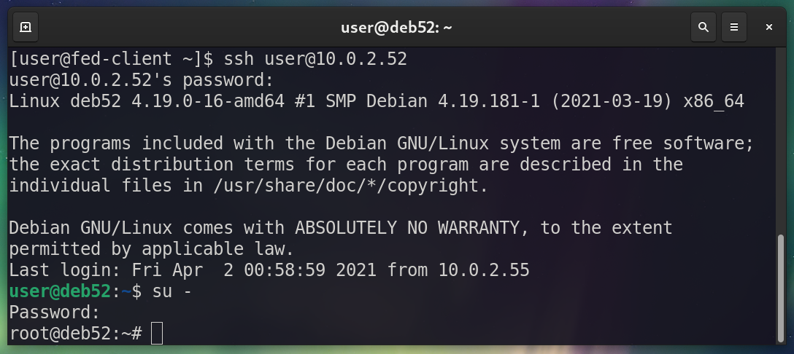

# Part IV: Connecting between Computers with the Command Line

As often mentioned, sysadmins *live* in the command line. It's all about controlling systems remotely and moving files via the command line. There are plenty of tools available to accomplish these tasks. In this section we cover SSH, SCP, rsync, and SFTP. 

## ***SSH***

The Secure Shell (or SSH) is used  to remotely control another system from the command line. It involves a 4-step process. 

1. client initiates a connection to an SSH “server”
2. Server sends out a public key
3. The two handshake on parameters and open a secure channel
4. the user at the client logs in to the server

There are a variety of SSH tools including PuTTY, WinSCP, CyberDuck, and so on. However, OpenSSH is built-in to most Linux Distributions and can be installed or updated as necessary. That’s what we will focus on during this webinar.

### Lab 4-1
**Using SSH**

In this lab we'll verify whether SSH is running as a server, and connect from one machine to another using SSH.

- Verify if SSH is available on the target computer.

	Use the command `ssh -V` to see if SSH is installed. The following example shows that OpenSSH version 7.9 is installed on a Debian client:

	```bash
	user@deb52:~$ ssh -V
	OpenSSH_7.9p1 Debian-10+deb10u2, OpenSSL 1.1.1d  10 Sep 2019
	```

	If it is not installed, you can install it, for example:

	`apt install openssh-server`

	Replace "apt" with whatever package manager your distribution uses. 

- Check if the OpenSSH server service is running.

	In most instances, OpenSSH uses two services: ssh (for the client) and sshd (for the server). We are interested in the server service on the target computer. To see if the server service is running, type the command:

	`systemctl status sshd`
	
	You should see something similar to the following:

	```bash
	user@deb52:~$ systemctl status sshd
	● ssh.service - OpenBSD Secure Shell server
	   Loaded: loaded (/lib/systemd/system/ssh.service; enabled; vendor preset: enabled)
	   Active: active (running) since Thu 2021-04-01 15:03:17 EDT; 9h ago
	     Docs: man:sshd(8)
		   man:sshd_config(5)
	  Process: 513 ExecStartPre=/usr/sbin/sshd -t (code=exited, status=0/SUCCESS)
	 Main PID: 542 (sshd)
	    Tasks: 1 (limit: 4685)
	   Memory: 6.6M
	   CGroup: /system.slice/ssh.service
		   └─542 /usr/sbin/sshd -D
	```

	If it is not active and running, you can enable and start it by typing:

	`systemctl --now enable sshd`

	> Note: Make sure the service is active and running on the target computer, or you won't be able to "SSH" into that system to take control of it.

	You can also check the ports of the target system with the following command:

	`ss-tulnw`

	This will show results similar to the following:

	```bash
	user@deb52:~$ ss -tulnw
	Netid    State     Recv-Q    Send-Q        Local Address:Port          Peer Address:Port    
	icmp6    UNCONN    0         0                         *:58                       *:*       
	udp      UNCONN    0         0             192.168.122.1:53                 0.0.0.0:*       
	udp      UNCONN    0         0            0.0.0.0%virbr0:67                 0.0.0.0:*       
	udp      UNCONN    0         0                   0.0.0.0:49470              0.0.0.0:*       
	udp      UNCONN    0         0                   0.0.0.0:5353               0.0.0.0:*       
	udp      UNCONN    0         0                      [::]:37078                 [::]:*       
	udp      UNCONN    0         0                      [::]:5353                  [::]:*       
	tcp      LISTEN    0         80                127.0.0.1:3306               0.0.0.0:*       
	tcp      LISTEN    0         32            192.168.122.1:53                 0.0.0.0:*       
	tcp      LISTEN    0         9                   0.0.0.0:21                 0.0.0.0:*       
	tcp      LISTEN    0         128                 0.0.0.0:22                 0.0.0.0:*       
	tcp      LISTEN    0         128                       *:80                       *:*       
	tcp      LISTEN    0         9                      [::]:21                    [::]:*       
	tcp      LISTEN    0         128                    [::]:22                    [::]:*   
	```

	You can see on the 11th line that port 22 is being listened on. That is the default SSH inbound port.

	At this point, the OpenSSH server should be ready to accept connections. 

- Connect to the system running OpenSSH as a server from a separate computer. 

	Now we can connect to our "server" using the SSH command from a client computer. In this lab I use a Fedora system to connect to the Debian system that is acting as the OpenSSH server. The standard command looks like this:

	`ssh user@10.0.2.52`

	`ssh` is the command. `user` is the account on the target system that you will use to control it. `10.0.2.52` is the target IP address that we are connecting to. That is the typical syntax when working with SSH. Of course, your usernames and IPs may be different.

	> Note:	If you are using VirtualBox for your virtual machines, the typical SSH syntax probably won't work. You either need to set up some sort of routing, or configure port forwarding in VirtualBox (preferred). When you connect in this manner, the typical syntax looks similar to this:

		`ssh user@127.0.0.1 -p 2222`

		For more information on VirtualBox port forwarding, see [this link](/virtualbox/#how-to-setup-ssh-capability-into-a-virtualbox-guest-on-a-nat-network). 

	At this point, we should be able to control the target computer, based on the user account's permissions. The figure below shows a Fedora system (named *fed-client*) that has SSH'd into the Debian system (named *deb52*). After logging in with SSH as the user account, I then logged in as root by typing `su -` and the password for the root account on the Debian system. 

	<figure>
	  
	  <figcaption>Figure 4-1: Connecting from a Fedora system to a Debian system with SSH</figcaption>
	</figure>

	> Warning! In the field it is recommended to avoid the use of the root account whenever possible. The use of root access in these labs is for educational purposes only. 

	When finished, we can log out of the SSH session by typing `exit` or by pressing Ctrl + D on the keyboard.

## ***SCP***

SCP (or Secure Copy) allows a person to copy one file or entire directories to separate systems. It works as an extension of SSH. But it doesn’t log into systems, and there is no shell involved (unlike SFTP for example). It is primarily a one-time use command. 

### Lab 4-2
**Using SCP**

In this lab we'll use SCP to copy files from a local host to a remote host, and vice-versa. The general syntax for this would be:

	`scp <source> <destination>`

- Copy a file from the local host to the remote host. 

	This is known as a "push" of data. 

	The source will be a file (debian.iso) on our local system, which is a Debian client (*deb52* at 10.0.2.52). The destination will be the remote computer, which is a Debian server (*deb51* at 10.0.2.51). 

	!!! note
		Any large file will do. In this lab I'm using a 300 MB Debian ISO image that I renamed to debian.iso. You can get the various Debian images at the following link: https://www.debian.org/distrib/netinst. You could also grab this particular image using the wget command:

		`wget https://cdimage.debian.org/debian-cd/current/amd64/iso-cd/debian-10.9.0-amd64-netinst.iso`

	Here's an example using SCP to copy from the local system to a remote system:

	`scp debian.iso user@10.0.2.51:/home/user`

	So the source is "debian.iso"

	And the desintation is "user@10.0.2.51:/home/user"

	Here is what we see on the screen when we issue the command from the Debian client. 

	```bash
	user@deb52:~/Downloads$ scp debian.iso user@10.0.2.51:/home/user
	user@10.0.2.51's password: 
	debian.iso                          100%  336MB 188.4MB/s   00:01	
	```

	Let's break down what is happenening here. First, we issue the `scp` command. Second, we specify the file to be copied. The file is debian.iso, and its located in the Downloads directory. Next, we state the user account and IP address that we want to connect to. Remember that SCP works off of SSH, so the login process works in the same manner. In this case, we are connecting as "user" on the IP address 10.0.2.51. (Note that you should make sure that the "user" account exists on the remote system.) After that, we state the path on the destination computer where we want to copy the file. Always use a colon (:) after the IP address and before the path, then give a valid Linux path. In this case, we copied the file to the /home/user directory. When we press enter, it asks for credentials (based on SSH) - in this case the password of the user account on the remote system. Once we type the correct password, the file transfer is initiated. It copied the debian.iso file (336 MB in size) in one second to the destination. That's it!

	> Note: Remember to know exactly what the source and the destination are. Also, make sure that you know the user account and password of the remote machine. Finally, make sure that the user account in question has the appropriate permissions to copy files. 

- Copy a file from the remote host to the local host. 

	This time we'll copy a file, but in reverse. We'll do this at the Debian client once again, but now we'll grab the data from the server. This is known as a "pull" - when the data comes from the remote system and arrives at the local system that we are working at. 

	`scp user@10.0.2.51:/home/user/debian.iso /home/user/Downloads/debian2.iso`

	Here it is in action:

	```
	user@deb52:~/Downloads$ scp user@10.0.2.51:/home/user/debian.iso /home/user/Downloads/debian2.iso
	user@10.0.2.51's password: 
	debian.iso                              100%  336MB 172.6MB/s   00:01    
	user@deb52:~/Downloads$ ls
	debian2.iso  debian.iso
	```
	
	This time, the file is stored at the Debian server (which is 10.0.2.51). I simply took the same debian.iso file and copied it back. But I renamed it during the copy to "debian2.iso" so that it wouldn't overwrite the file we already had. Afterward, you can see the `ls` command displays both .iso files within the Downloads directory. Of course, you could copy it without a file name to whatever location you want, or change the name as you see fit. At that point, the basic rules of Linux copying take effect. 

	!!! note
		You can also copy entire directories. Just use the `-r` option after scp. It works in the same manner as the `cp` command locally. You can in fact use SCP locally as well, but for the most part sysadmins use it for remote copying of files as that is what it is mainly designed for. 

## ***rsync***

rsync is a fast, versatile, remote (and local) file-copying tool (to quote the MAN page!). While it can be used for local copying of files, it is more commonly used for remote copying. One of the great features of rsync is that it can act as an archive for your data and, after an initial file copy, will *incrementally* copy files as they are modified or added to a directory. This, among other things, makes it a formidable tool. 

*rsync should usually work over SSH by default.* If you have rsync installed on both systems, and SSH installed on both systems (and you probably do), and the SSH server is running on the remote system, and you know the password or have the key, then rsync will work over SSH automatically. That is generally the use case for administrators. 

> Note: One case where rsync is not installed by default is with Debian Buster (running as a server). However, a quick `apt install rsync` will remedy the situation. 

### Lab 4-3
**Working with rsync**

- Copy a file from a local system to a remote system. 

	Example:
	
	`rsync -a debian.iso user@10.0.2.51:/home/user`		

	As you can see, this is very similar to SCP. There is a source and a destination, and in this case we are "pushing" the file to a remote system (our Debian server). The only difference is the options that rsync uses (and there are a lot of them). I have added the archive option (-a) after rsync. This is a very commonly used option (in fact, I use it consistently). 

	Here are the results:

	```bash
	user@deb52:~/Downloads$ rsync -a debian.iso user@10.0.2.51:/home/user
	user@10.0.2.51's password: 
	user@deb52:~/Downloads$ 
	```

	It worked, but we don't see any results. By default, rsync goes by the "no news is good news" rule. So it won't tell us what is happening unless we request that information. Of course, if there was an error (no such directory, no permissions, etc...) then the program would tell us that there was a failure. Let's take it to the next level, and show how to display the current progress.

- Copy a group of files in a directory to a remote system.

	In this procedure we'll create two directories, and populate them with empty files. Then, we'll copy the both directories (and all the housed files) over to a remote location. Along the way we'll show how to display the progress of the file copy, and show how to use custom SSH ports. 

	> Note:	Make sure you are working in a test directory with no data. 
  
  For this lab I will be working within one directory (called Downloads) in a relative manner - meaning I won't be *changing* directories.

	- First, create two test directories named "test1" and "test2"

		`mkdir {test1,test2}`

	- Next, create 10 files within the test1 directory.

		`touch ./test1/file{1..10}`

	- Now, verify that the files are inside of the test1 directory.

		`ls ./test1`

	- Use rsync to copy the files to the test2 directory.

		`rsync ./test1/* ./test2`

	At this point, we should have two sets of identical files in the test1 and test2 directories. we can easily check this by using the tree command from our current location. The results look like this:
	
	```bash
	user@deb52:~/Downloads$ tree
	.
	├── debian2.iso
	├── debian.iso
	├── test1
	│   ├── file1
	│   ├── file10
	│   ├── file2
	│   ├── file3
	│   ├── file4
	│   ├── file5
	│   ├── file6
	│   ├── file7
	│   ├── file8
	│   └── file9
	└── test2
	    ├── file1
	    ├── file10
	    ├── file2
	    ├── file3
	    ├── file4
	    ├── file5
	    ├── file6
	    ├── file7
	    ├── file8
	    └── file9

	2 directories, 22 files
	```
	
	So you can see that we are currently located in the Downloads directory. Inside that we have the test1 and test2 directories, each with 10 files. 

	!!! note
		If you don't have access to the tree command, simply install it. For example, Debian doesn't include it by default, so `apt install tree`. 


	Now we can finally copy the contents to the remote system! This next command is a little more advanced. 

	`rsync -avP -e "ssh -p 22" {test1,test2} user@10.0.2.51:/home/user`

	Here are the results at the local system where we run the command:

	**Example**

		```bash
		user@deb52:~/Downloads$ rsync -avP -e "ssh -p 22" {test1,test2} user@10.0.2.51:/home/user
		user@10.0.2.51's password: 
		sending incremental file list
		test1/
		test1/file1
			      0 100%    0.00kB/s    0:00:00 (xfr#1, to-chk=19/22)
		test1/file10
			      0 100%    0.00kB/s    0:00:00 (xfr#2, to-chk=18/22)
		test1/file2
			      0 100%    0.00kB/s    0:00:00 (xfr#3, to-chk=17/22)
		test1/file3
			      0 100%    0.00kB/s    0:00:00 (xfr#4, to-chk=16/22)
		test1/file4
			      0 100%    0.00kB/s    0:00:00 (xfr#5, to-chk=15/22)
		test1/file5
			      0 100%    0.00kB/s    0:00:00 (xfr#6, to-chk=14/22)
		test1/file6
			      0 100%    0.00kB/s    0:00:00 (xfr#7, to-chk=13/22)
		test1/file7
			      0 100%    0.00kB/s    0:00:00 (xfr#8, to-chk=12/22)
		test1/file8
			      0 100%    0.00kB/s    0:00:00 (xfr#9, to-chk=11/22)
		test1/file9
			      0 100%    0.00kB/s    0:00:00 (xfr#10, to-chk=10/22)
		test2/
		test2/file1
			      0 100%    0.00kB/s    0:00:00 (xfr#11, to-chk=9/22)
		test2/file10
			      0 100%    0.00kB/s    0:00:00 (xfr#12, to-chk=8/22)
		test2/file2
			      0 100%    0.00kB/s    0:00:00 (xfr#13, to-chk=7/22)
		test2/file3
			      0 100%    0.00kB/s    0:00:00 (xfr#14, to-chk=6/22)
		test2/file4
			      0 100%    0.00kB/s    0:00:00 (xfr#15, to-chk=5/22)
		test2/file5
			      0 100%    0.00kB/s    0:00:00 (xfr#16, to-chk=4/22)
		test2/file6
			      0 100%    0.00kB/s    0:00:00 (xfr#17, to-chk=3/22)
		test2/file7
			      0 100%    0.00kB/s    0:00:00 (xfr#18, to-chk=2/22)
		test2/file8
			      0 100%    0.00kB/s    0:00:00 (xfr#19, to-chk=1/22)
		test2/file9
			      0 100%    0.00kB/s    0:00:00 (xfr#20, to-chk=0/22)

		sent 1,165 bytes  received 404 bytes  448.29 bytes/sec
		total size is 0  speedup is 0.00
		```

	Everything copied to the server. But what exactly happened here? Well, let's review the command we issued:

	`rsync -avP -e "ssh -p 22" {test1,test2} user@10.0.2.51:/home/user`
	
	The -a option is for archiving which we used before. But we also added -v for verbose, meaning we get a detailed response of what rsync is doing. -P is for progress. This gives us the status in real time (super-handy). Next, we see `ssh -p 22` which is telling us which shell to use (SSH), and the port to run it on (22). Because SSH is already running, and because we are using port 22 by default, we don't have to include this option. However, in many scenarios, SSH will be configured to use a different port (such as 2222) - in that case you would need to specify it: `ssh -p 2222`. We'll discuss this concept more in Day 2. Finally, we copied both directories `{test1,test2}` by simply comman separating them and encapsulating them in curly braces. You don't need the entire path or even relative paths when using rsync.  

	> Note:	You could also install the progress program (`apt install progress`) and run the `watch progress` command to view the progress of processes including large data transfers with rsync or SCP, DD processes, and anything else that runs behind the scenes. 

	Subsequent transfers using the same command will work in an incremental fashion. That means that only new files or files that have been changed will be copied over. rsync processes each file during the initial and subsequent file copy processes. This makes for quick periodic (or incremental) backups.

	> Note:	Automate with rsync! Use it within a cron job or other automated system to periodically copy files from one location to another. But be sure to test it periodically too! Make sure your file copies are running properly!

## ***SFTP***

Secure File Transfer Protocol (SFTP) is widely used for remote file uploads and retrieval. Like SCP, SFTP piggybacks on SSH. But where SCP is used for single file transfers, SFTP can be used to move multiple files and directories - multiple times within an SFTP session. 

SFTP can resume file transfers and has more functionality than SCP, plus when you log in, you are placed in the SFTP shell, where you have many commands at your disposal. You can manipulate the remote system's directories and files as well as the local system's files and directories when you are logged into an SFTP shell. 

> Note: There are plenty of other SFTP packages available. For this lab we will simply use SFTP, which works as part of OpenSSH. 

### Lab 4-4
**Using SFTP**

In this lab, we'll connect to an SFTP server, view the contents, retrieve a file, and place a file on the server as well. In the example I'll be showing a Fedora system (10.0.2.55) connecting to a Debian system (10.0.2.52), but any Linux distribution will work in the same manner as long as you have OpenSSH installed. 

- Connect to the OpenSSH server (Debian client for this lab)

	`sftp user@10.0.2.52` 

	Login with your password.

	Change to the Downloads directory: `cd Downloads`. Then type `ls` to see its contents. (If you are not using the Downloads directory, access whatever directory you are storing files in.)

	You should see similar results to this:

	```bash
	[user@fed-client ~]$ sftp user@10.0.2.52
	user@10.0.2.52's password: 
	Connected to 10.0.2.52.
	sftp> cd Downloads/
	sftp> ls
	debian.iso   debian2.iso  test1        test2        
	sftp> 
	```

	Here we can see the debian .iso files and the test1 and test2 directories that we worked with previously. 

- Retrieve a file from the SFTP server.

	Retrieving a file is easy. Type `get <filename>`. That's it. So for example:

	`get debian.iso`

	That will grab the debian.iso file from the remote system, and place it in the last directory we were working in. In this scenario I happened to be working in the Desktop directory. To show that the file indeed downloaded to our local system, we can run the `lls` command, which is *local* list directory contents. This is all shown in the example below:

	```bash
	sftp> get debian.iso
	Fetching /home/user/Downloads/debian.iso to debian.iso
	/home/user/Downloads/debian.iso                                                                       100%  336MB 210.8MB/s   00:01    
	sftp> lls
	debian.iso
	sftp> 
	```

	> Note:	Many commands can be run locally while in an SFTP session. Just place an 'l' before the command. For example, `cd` becomes `lcd`, `mkdir` becomes `lmkdir`, and `pwd` becomes `lpwd`. 

- Place a file on the remote system.

	Pushing files to the remote system is easy also. Just use the put command. For example:

	`put debian.iso`

	That will put the file into the current remote working directory. That file is actually already there, so we can change the remote directory if need be. In the example below, I create a new directory, change to it, and then put the file in that new directory.

	```bash
	sftp> lls
	debian.iso
	sftp> mkdir isos
	sftp> cd isos
	sftp> put debian.iso
	Uploading debian.iso to /home/user/Downloads/isos/debian.iso
	debian.iso                                                                                            100%  336MB 252.8MB/s   00:01    
	sftp> 
	```

	While in an SFTP session, press the ? key to access a basic help system and list of commands that you can run. 
	
	That's about it. When finished you can exit the session by typing `bye` or `quit` or by pressing Ctrl + d. 

## ***Summary***
	
  That wraps up the section on SSH, SCP, rsync, and SFTP. They are powerful tools, and each one has its own purpose. Practice with them to master their usage. 
  
  We worked with the Secure Shell (SSH) to remotely control systems from the command line. We also worked with Secure Copy (SCP) to easily copy files from one system to another over an SSH connection. Then we used an alternative to SCP called rsync which not only copies files, but can archive them, and work in an incremental fashion. Finally, we used Secure FTP (SFTP) to move files back and forth between a local system and a remote system. SFTP, unlike SCP and rsync, works within an interactive shell which allows us to perform many actions instead of just one. 
  
  With SCP, rsync, and SFTP, transactions are either *push* (from the local system to the remote system) or *pull* (from the remote system to the local system). The command structure is always `command source destination` regardless of whether you are performing a push or a pull. 
  
  Remember to practice these commands as much as possible to become familiar with them. This skill is necessary for most IT technicians. 
  
  > Reminder: To learn more about any one of these commands, simply type `<command> -h` or `man <command>` - where `<command>` is either ssh, scp, rsync, or sftp. 

---

And that does it for the Day 1 Lab Guide. Phew! Until the next round!
